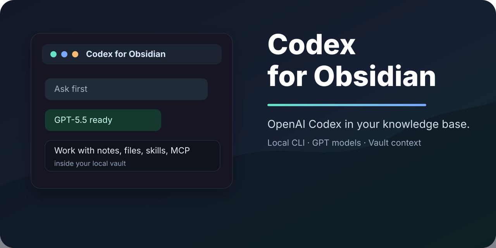

# Codex for Obsidian

Bring OpenAI Codex into your Obsidian vault as a local, sidebar-native AI collaborator.

[English README](docs/README.en.md) | [中文说明](docs/README.zh-CN.md)

## What Is This?

Codex for Obsidian is a desktop-only Obsidian community plugin that embeds the local Codex CLI experience inside Obsidian. It is designed for people who want to use GPT/Codex to read notes, edit writing, reason over vault context, and work with local files without leaving Obsidian.

This project was vibe-coded from Claudian and adapted into a Codex-first plugin. See [Credits](docs/README.en.md#credits) for details.

## Quick Links

- Install guide: [English](docs/README.en.md#installation) / [中文](docs/README.zh-CN.md#安装)
- Requirements: [English](docs/README.en.md#requirements) / [中文](docs/README.zh-CN.md#依赖条件)
- Usage: [English](docs/README.en.md#usage) / [中文](docs/README.zh-CN.md#使用方式)

## Obsidian Files

Manual installation only needs these files from the latest release:

- `manifest.json`
- `main.js`
- `styles.css`

